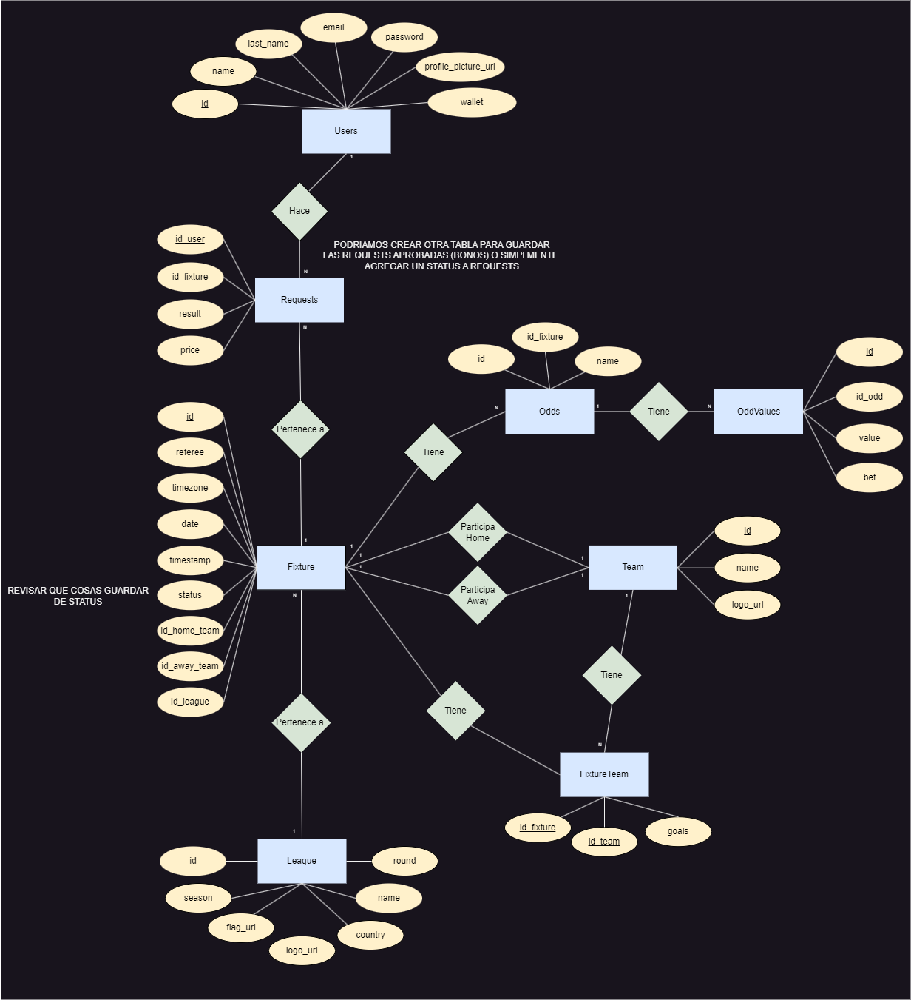

# 2024-1 / IIC2173 - E0 | CoolGoat Async

# Dominio
- API [entregasarquicrisinguc.xyz](https://entregasarquicrisinguc.xyz) 
- [numby.me](https://numby.me)
- [www.numby.me](https://www.numby.me)

_"...the Warp Trotter "[Numby](https://honkai-star-rail.fandom.com/wiki/Topaz_and_Numby)," is also capable of acutely perceiving where "riches" are located. It can even perform jobs involving security, debt collection, and actuarial sciences."_

# Consideraciones generales

- El root directory ```/``` redirige automáticamente a ```/fixtures```.
- Se definio el atributo ```flag``` de ```league``` como ```<string|null>``` para ajustrse a los nuevos partidos del ```02/09/2024```.
- El endpoint ```/fixtures{:identifier}``` utiliza el ```id``` del _nested object_ ```fixtures``` para identificar los partidos.
- El parámetro ```page``` en el endpoint ```/fixtures``` comienza desde ```0```.

# ER-Model




# Setup

## Instalar Docker Compose

```sh
sudo curl -L "https://github.com/docker/compose/releases/download/1.29.2/docker-compose-$(uname -s)-$(uname -m)" -o /usr/local/bin/docker-compose
sudo chmod +x /usr/local/bin/docker-compose
```

Para revisar si se instaló bien

```sh
docker-compose --version
```

## Construir imagenes con Docker Compose

Para construir y levantar la base de datos, api y listener del broker ejecutar el siguiente comando en el mismo directorio que el archivo `docker-compose.yaml`
```sh
docker-compose up --build
```

Si se agrega `-d` se corre en background

## Nginx

### Instalar NGINX
```sh
  sudo apt update
  sudo apt install nginx
```

### Configurar NGINX

Necesitas desvincular la página predeterminada para poder cambiar la configuración predeterminada:
```sh
  sudo unlink /etc/nginx/sites-enabled/default
```

Luego necesitas escribir tu propio archivo de configuración o usar el archivo `api.conf` proporcionado.

Para copiar el `api.conf` proporcionado a `/etc/nginx/sites-enabled/`.
```sh
sudo cp ./api.conf /etc/nginx/sites-enabled/
```

Para crear un nuevo `api.conf` en el directorio
```sh
sudo touch ./api.conf /etc/nginx/sites-enabled/api.conf
```

Para editar el `api.conf`

```sh
sudo nano ./api.conf /etc/nginx/sites-enabled/api.conf
```

Finalmente, puedes probar nginx y reiniciarlo cuando no muestre errores.
```sh
sudo nginx -t
sudo systemctl restart nginx
```

## SSL Certificate
Seguir instrucciones de [https://certbot.eff.org/](https://certbot.eff.org/)

Para realizar el chequeo de expiración dos veces al día generar una tarea con crontab
```sh
sudo crontab -e
```

Agregar la siguiente tarea
```
0 0,12 * * * certbot renew --quiet
```